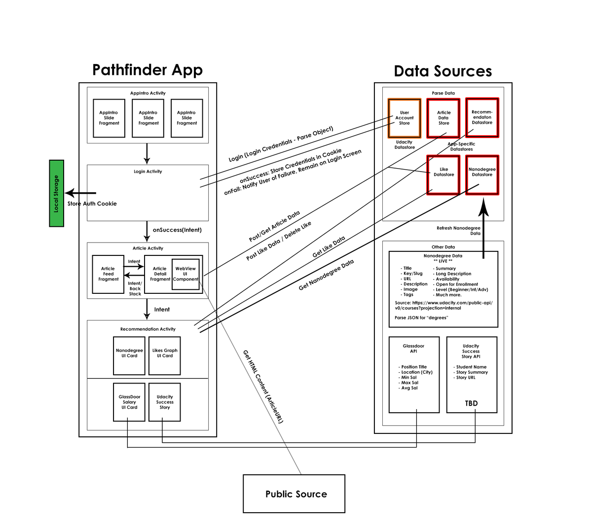

# Android Pathfinder - Nanodegree Recommender App

- Organizer/Sponsor: Kathleen Mullaney (kathleen@udacity.com)
- Developer (Android): Brandy Camacho (brandycamacho@gmail.com)
- Developer (Android): Miraj Hassanpur (mjhassanpur@gmail.com)
- Project Manager: Dustan Curtis (dustan.curtis@gmail.com)

## Project Links
- [Project Details - Google Docs](https://docs.google.com/document/d/1Uby7aBzzPMurJwWqGz8a8yTZbI7Hq8voejFuOl25LrA/edit)
- [Github Repo](https://github.com/udacity/udacity-android-pathfinder)
- [Google Calendar](https://www.google.com/calendar/embed?src=inba908cb4u1aqvr727gplpnag%40group.calendar.google.com&ctz=America/Vancouver)
- [Google Hangouts](https://hangouts.google.com/hangouts/_/u5dhsdrvr2tgtzehfogded6of4a)
- [Trello](https://trello.com/b/DyS4zb4y)

## Project Assets
### App Pathway

### Draft Architecture (To Expand)

### Likes Relation

## Major Milestones
October 1 - Project Start

### Sprint 1 (Ends: October 15)
1. Complete AppIntro Activity (October 15 - BM)
2. Complete Login Activity (October 15 - BM)
3. Complete Article Activity (October 15 - Feed - MH)
4. Complete Article Datastore (October 15 - BM/MH)

### Sprint 2 (Ends: October 22)
1. Complete Article Detail (Webview/Like Functionality) (October 22 - MH)
2. Add Pagination/Syncing for Article Feeds (October 22 - MH)
3. Complete Recommendation Activity UI (October 22 - MH)
4. Complete Recommendation Datastore (October 22 - BM)
5. Complete Nanodegree Datastore (October 22 - BM)
6. Complete Parse Job to Refresh Nanodegree Datastore (October 22 - BM)
7. Complete Like Datastore (October 22 - BM)

### Sprint 3 (Ends: October 29)
1. Design Dynamic Articles Service; or
2. Populate Article Store with Static Content
3. Enhance MVP - Glassdoor API, Udacity Stories, Article Detail Branding/UI Customizations

### Finishing Up (November 6 - Project Due)
1. Prepare for Play Store
2. Update with Release Assets/Build Config/Signing
3. Thoroughly Test All Functionality
4. Dog Fooding - *Allow Subset of Udacity Employees to Use App*