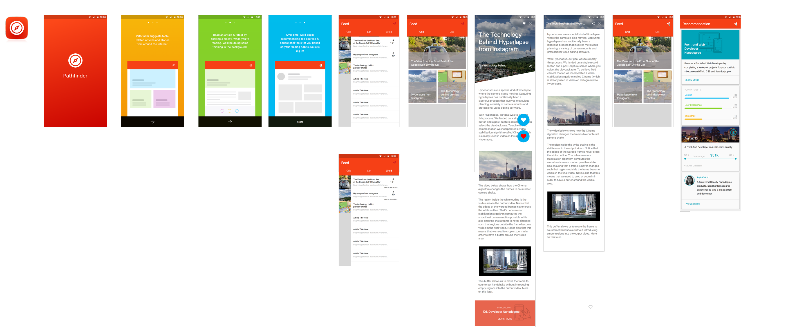

# Android Pathfinder - Nanodegree Recommender App

- Organizer/Sponsor: Kathleen Mullaney (kathleen@udacity.com)
- Developer (Android): Brandy Camacho (brandycamacho@gmail.com)
- Developer (Android): Miraj Hassanpur (mjhassanpur@gmail.com)
- Project Manager: Dustan Curtis (dustan.curtis@gmail.com)

## Project Links
- [Project Details - Google Docs](https://docs.google.com/document/d/1Uby7aBzzPMurJwWqGz8a8yTZbI7Hq8voejFuOl25LrA/edit)
- [Github Repo](https://github.com/udacity/udacity-android-pathfinder)
- [Google Calendar](https://www.google.com/calendar/embed?src=inba908cb4u1aqvr727gplpnag%40group.calendar.google.com&ctz=America/Vancouver)
- [Google Hangouts](https://hangouts.google.com/hangouts/_/u5dhsdrvr2tgtzehfogded6of4a)
- [Trello](https://trello.com/b/DyS4zb4y)

## Project Assets
### App Pathway

### Draft Architecture (To Expand)

### Likes Relation

## Major Milestones
October 1 - Project Start

### Sprint 1 (Ends: October 15)
1. ~~Complete AppIntro Activity (October 15 - BM~~)
2. ~~Complete Login Activity (October 15 - BM~~)
3. ~~Complete Article Feed Activity (October 15 - Feed - MH~~)
4. ~~Complete Article Datastore (October 15 - BM/MH~~)
*Note: Core functionality implemented, need to polish UI.*

### Sprint 2 (Ends: October 22)
1. ~~Complete Article Detail (Webview/Like Functionality) (October 22 - MH~~)
2. ~~Complete Recommendation Activity UI (October 22 - DC~~)
3. ~~Complete Nanodegree Datastore (October 22 - BM~~)

### Sprint 3 (Ends: October 29)
1. ~~Complete Pagination/Syncing for Article Feeds (October 29 - MH)~~
2. ~~Complete Parse Job to Refresh Nanodegree Datastore (October 29 - BM)~~
3. Populate Article Store with Static Content (min 10 for each category = 80 articles) - (October 29 - All)
4. ~~Complete Recommendation Datastore (October 29 - BM)~~
5. ~~Implement ‘Add Article’ ui popup (DialogFrag?) - (October 29 - MH)~~
6. ~~Complete Like Datastore (October 29 - BM)~~
7. Complete Like Functionality (October 29 - MH) - Partial
8. ~~Polish Sprint 1/2 Features (Prod assets, standardized fonts/colors/text sizes, HD images, etc.)~~

### Finishing Up (November 6 - Project Due)
1. Prepare for Play Store (November 6 - DC)
2. Update with Release Assets/Build Config/Signing (November 6 - DC)
3. Thoroughly Test All Functionality (November 6 - All) 
4. Dog Fooding - *Source ~1000 Articles, Allow Subset of Audacity Employees to Use App* (November 6 - Udacity Employees)
5. ~~Polish all Activities~~
6. Enhance MVP - Glassdoor API, Udacity Stories, Article Detail Branding/UI Customizations
7. ~~Polish Sprint 1/2/3 Features (Prod assets, standardized fonts/colors/text sizes, HD images, etc.)~~

### Final Checklist

#### Changes
- ~~Feed/Icon spacing at top of Feed Activity~~
- ~~Arrow icon spacing~~
- ~~Add Article popup: lookup image, pull title automatically~~
- Show number of times each article is liked
- Only Liked articles in Liked feed
- ~~Change heart-pressed color~~
- Recommendation UI bug
- ~~Recommendation threshold~~
- Android Notification w/ Link to Recommendation Activity

#### Release Prep
##### Auth
- Production Facebook
- Production Twitter
- Production Google
- Production Udacity
- Proudciton Parse

##### Keys
- Production Android keystore
- Twitter??
- Facebook??
- Parse??